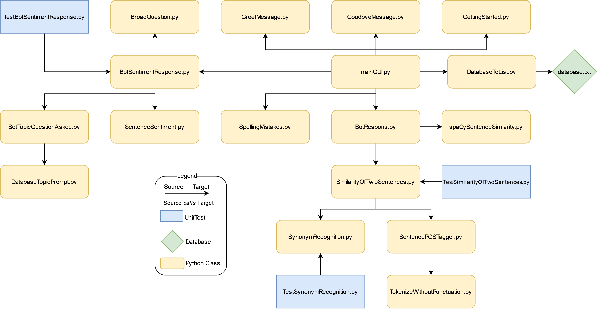

# Introduction
This project's objective is to create a conversational agent that carries on a conversation with the user by responding to user’s input with prompts and questions. The role of the conversational agent that we have created is to act as a therapist that specializes in loneliness. So as you are using this program, try to stay in the mindset of a patient at a therapist’s office to bring out the most of the program's functionality.

# What's New
In order to improve the chatbot experience, the following features have been implemented:
| Feature    | Description |
| ---------- | ----------------------------------------------------------------------- |
| Simple GUI | Previously, the chatbot conversion was held in a terminal. Now, with the use of the tkinter GUI package, the user can have a conversation with the chatbot in a much nicer interface, providing a much more realistic chatbot experience.  |
| Spell-checker | Previously, the chatbot would respond to misspelled words with a general error message or assumed what the user meant. Now, with the use of the NLTK corpus, the chatbot recognizes which words are misspelled and notifies the user so they can correct themselves. This ensures the chatbot understands the user correctly rather than guessing, which will increase the accuracy of the chatbot’s responses.  |
| POS Tagging & Tokenization | The use of POS tagging and tokenization via NLTK assists in the chatbot’s ability to recognize synonyms as these identifiers help determine what type of synonyms are being used.  |
| Synonym Recognition | This new implementation of synonym recognition using NLTK allows the chatbot to accept a wider range of responses, rather than being restricted to the vocabulary used in the database.  |
| Sentiment Analysis Tools | This new implementation of sentiment analysis using NLTK analyzes the user’s input and calculates a positive or negative sentiment score. Using this score, the chatbot can then determine what type of response to reply with. For example,  a negative sentiment score will trigger the chatbot to ask a specific question. Whereas with a positive sentiment score, the chatbot will respond with an open-ended question since the user is in a healthy headspace.  |
| Better Similarity Recognition | The implementation of spaCy - USE further improves the chatbot’s sentence comparison feature. This allows the chatbot to provide better, more accurate, responses to the user’s input.  |
| Implementing Google Translation | This implentation will translate part of the conversation into another language. This allows the chatbot to be of use by a greater number of people  |
| Implementing the wolframAlpha API| Implementing this API opens up the conversation; however, it is still restricted to what wolframAlpha can answer, you no longer need to only ask questions that are in the database.  |

# How to Run
In order to run the chatbot, you must install NLTK, NLTK Data, and spaCy - Universal Sentence Encoder onto your computer before proceeding.

To install NLTK and NLTK Data, please refer to this link: https://www.nltk.org/install.html

To install spaCy - Universal Sentence Encoder, please refer to this link: https://spacy.io/universe/project/spacy-universal-sentence-encoder or https://github.com/MartinoMensio/spacy-universal-sentence-encoder

As there is a Google Translate API implemented, you will need to install the library needed to run the program, you can do this simply by doing
pip install googletrans

Once all three have been installed, clone the Github repository and run the mainGUI class.

# Explanations of classes/files:

- **BotRespons:** 
A class that has a single method. The method, bot_respons, takes in three inputs: a string, list, and a module from Universal Sentence Encoder. Next, the method will invoke SimilarityOfTwoSentences's sentence_similarity in a loop. The loop iterates through each element of the inputted list. The loop will determine the best "answer" and the respective matching score. If the matching score is less than 0.8, then the method will invoke spaCySentenceSimilarity's spaCy_sentence_similarity, passing through the inputted string, list, and a module from Universal Sentence Encoder. Additionally, will set "spaCyUsed" to True. The spaCy_sentence_similarity will return the best "answer" and the respective matching score. The method, bot_respons, returns the best "answer", determined via either sentence_similarity or spaCy_sentence_similarity, its respective matching score, and whether spaCy_sentence_similarity was used. 
- **BotSentimentResponse:**
A class with a single method. The method, bot_sentiment_response, takes in a String and list. With said inputted String, the method performs sentiment analysis using SentenceSentinment's sentence_sentiment. If the sentiment is positive, greater than 1, the method returns a string from BroadQuestion's broad_question and the inputted list. Else, the method invokes BotTopicQuestionAsked's bot_topic_question_asked passing through the inputted list. Afterward, the method stores the returned question, from bot_topic_question_asked, into a variable, and assigns the inputted list to the returned list from bot_topic_question_asked. Finally, the method returns the question and input list.
- **BotTopicQuestionAsked:**
A class with a single method. The method, bot_topic_question_asked, takes in a list. Right away, the method invokes DatabaseTopicPrompt's database_topic_prompt. Using the values returned from database_topic_prompt, the method determines if the size of the inputted list is greater than or equal to the size of the pre-defined list in database_topic_prompt. If it is, then the method resets the inputted list and appends the question returned from database_topic_prompt into the inputted list. After appending, the method returns the list and question from database_topic_prompt. If the length of the inputted string is less than the pre-defined list in database_topic_prompt, then the method will invoke database_topic_prompt until a question is found that is not already in the inputted list. After finding said question, the question will be appended into the inputted list, and the question from database_topic_prompt will be returned and the modified inputted list.
- **BroadQuestion:**
A class with a single method. The method, broad_question, takes in no parameters. broad_question contains 13 open-ended questions.  Randomly returns one of the 13 questions
- **Database:** 
A text file containing various sentences in paired form. The sentence before "@" is called a "prompt", and after "@" is called the "answer". Each "answer" is tailor-made for its respective "prompt".
- **DatabaseToList:**
A class with a single method. The method, DatabaseToList, takes in no parameters. Reads through the file database.txt, and converts the content of database.txt into a 2-d list. After converting the database.txt into a 2-d list, the method returns said list
- **DatabaseTopicPrompt:**
A class with a single method. The method, database_topic_prompt, takes in no parameters. The method database_topic_prompt contains six question which are based upon various topics covered in database.txt.  Randomly returns one of the six questions and the length of the pre-defined list.
GettingStarted: A class with a single method. The method, gettingStarted, takes no parameters. The method gettingStarted contains four questions. The said questions are designed to get the user to talk about their emotions.  Randomly returns one of the four questions.
- **GoodbyeMessage:**
A class with a single method. The method, goodbyeMessage, takes no parameters. The method gettingStarted contains four goodbye messages. Randomly returns one of the four goodbye messages.
- **GreetMessage:** 
A class with a single method. The method, greetMessage, takes in no parameters. The method greetMessage contains four greeting messages. Randomly returns one of the four messages.
- **mainGUI:** 
A class with GUI integration. The class loads in the Database into list form and the Universal Sentence Encoder. Next, the method asks the user for input. Depending on the input, the class would either move forward or display a message informing the user of the invalid input. An invalid input is one with a spelling mistake, not all letters, or more than one word. The program will not move forward until the input is valid. After the user inputs a valid input, the program invokes BotRespons' bot_respons, passing through the user input, a list, and the module from Universal Sentence Encoder. Depending upon whether spaCy was used, the best matching score must meet a specific value in order for the best "answer" to be outputted to the user. If the threshold is not meant the bot will respond with an answer informing the user that it does not understand. If the threshold is meant, and the best "answer" does have a "?", only the "answer" is outputted. If the threshold is meant and " answer" does not have "?", BotSentimentResponse's bot_sentiment_response is invoked. The "answer" and the returned question from bot_sentiment_response are outputted to the user. Finally, if the input is valid and is only one word, the bot says goodbye.
- **SentencePOSTagger:**
A class with a single method. The method sentence_pos_tagger takes in a String. sentence_pos_tagger invokes tokenize_without_punctuation passing through the inputted String to get the String in tokenized form. Afterward, with the tokenized String, the method uses NLTK's POS tagger to determine the various categories for each word. Finally, a list is returned with POS tags. 
SentenceSentiment: A class with a single method. The method, sentence_sentiment, takes in a String. The method uses NLTK's integration of VADER, a sentiment analysis toolkit. If the inputted String has a positive sentiment, "subjectivity" is assigned "Positive". Else-if the sentiment is negative, "subjectivity" is assigned " Negative". Else, the sentiment is 0, then "subjectivity" is assigned "Neutral". Finally, the sentiment score and "subjectivity" is returned
- **SimilarityOfTwoSentences:** 
A class with a single method. The method, sentence_similarity, takes in two Strings. If both Strings are of size 0, the method returns 1.0. Else, the method will transform the two strings into lists, userSplit, and promptSplit. Next, the method invokes SentencePOSTagger's sentence_pos_tagger, passing through the second string. Next, depending on the size of the two respective inputted Strings, the method will iterate "x" times, where x is the size of the smallest inputted String in terms of word count. In the said loop, the method determines the synonym for the second inputted String. The loop will go through each element and compare, for example userSplit[0] to promptSplit[0], userSplit[1] to promptSplit[1], etc. If the elements match or userSplit[i] matchs an element in the list of synonyms, then the method increases the "count" by 1. If the smaller inputted string is 0, the method returns 0.0. Else, the method, sentence_similarity, returns "count" divided by the length of smaller inputted String, in terms of word count.
- **spaCySentenceSimilarity:** 
A class with a single method. The method, spaCy_sentence_similarity, takes in a String, list, and module from Universal Sentence Encoder. Using the said module, the method compares the String with each "prompt" in the list. The method returns the "answer" of the best "prompt" alongside the matching score.
SpellingMistakes: A class with a single method. The method, spelling_mistakes, takes in a string. The method utilizes parts of NLTK's corpus, "brown" and "stopwords", to determine whether a word is correct or not. If the word is spelled correctly, i.e., is in the corpus "brown" or "stopwords", then "True" will be appended to a list "spelledCorrect". Else, "False" will be appended into "spelledCorrect", and the incorrect word will be appended to "wordSpelledIncorrect". If "spelledCorrect" contains "False", False will be returned alongside "wordSpelledIncorrect" by spelling_mistakes. Else, "True" will be returned alongside "wordSpelledIncorrect" by spelling_mistakes.
- **SynonymRecognition:**
A class with a single method. The method, synonym_recognition, takes in two strings, the first one being a word and the second one being a part-of-speech tag. Moreover, the method invokes NTLK's integration of Wordnet to get synonyms for the inputted word for a specific type of POS tag. If the tag is "NN" or "NNS", the method gets noun synonyms for the inputted word and returns the list. Else-if the tag is "RB", "RBR", or "RBS", the method gets adverb synonyms for the inputted word and returns the list. Else-if the tag is "JJ", "JJR", or "JJS", the method gets adjective synonyms for the inputted word and returns the list. Else-if the tag is "VB", " VBN", "VBZ", "VBP", "VBD", "VBG", the method gets verb synonyms for the inputted word and returns the list. If none of the conditions are meant, the method returns an empty list.
- **TestBotSentimentResponse:** 
A unit test, containing 18 tests, meant to test the robustness of BotSentimentResponse.py
- **TestSimilarityOfTwoSentences:** 
A unit test, containing 25 tests, meant to test the robustness of SimilarityOfTwoSentences.py
- **TestSynonymRecognition:** 
A unit test, containing 20 tests, meant to test the robustness of SynonymRecognition.py
- **TokenizeWithoutPunctuation:**
A class with a single method. The method, tokenize_without_punctuation, takes in a String. The method utilizes NLTK's RegexpTokenizer to tokenize the inputted String. When invoking NLTK's RegexpTokenizer, a list is returned with the tokenized content. Said list from NLTK is returned.
- **translateSentence:**
- This is a class with a single function. This class is the Google Translate API that takes in a string a translates the string into Korean.
